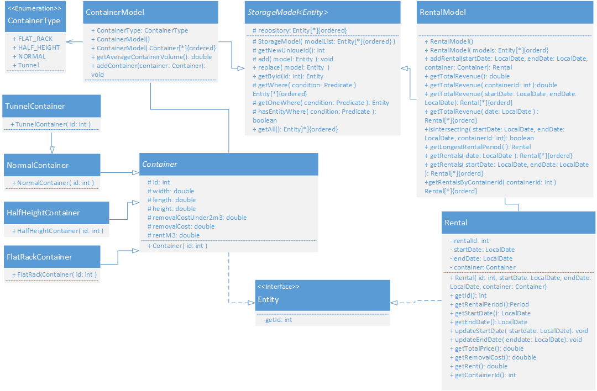

# The End Assignment of the module Java2
This project contains the last assignment of the Java2 module. For the assignment you have to create an project in Java
from scratch. The fist step is the design of the application you get an case assigned by the teacher and you have to 
analyze the data and create an UML Class Diagram from it. After designing the class hierarchy you have to add the 
classes methods and attributes to the diagram. If the diagram is accepted by the teacher you have to implement it in 
Java and write unit tests for it.

## Case 
# Iterator toevoegen.
# factory toevoegen

## UML Class Diagram
[
###Domain Model Diagram

###Diagram of Implementation Classes

##Code
[Click here to go to the code](ContainerCompany/)
  